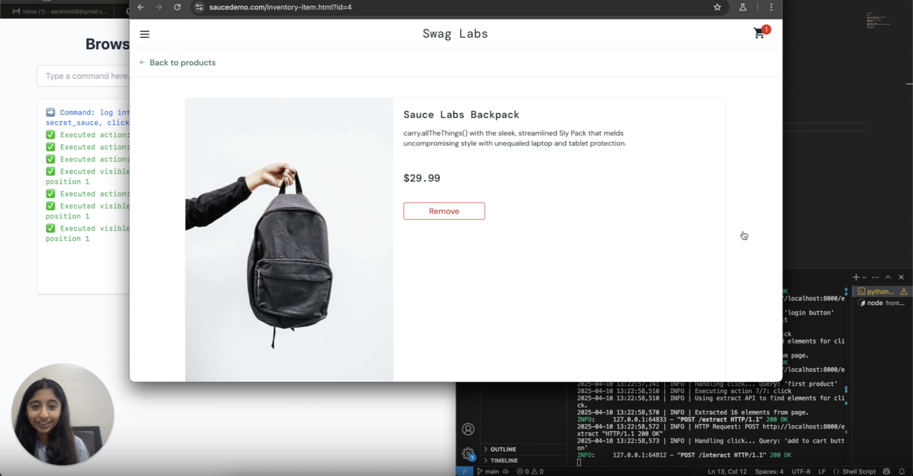
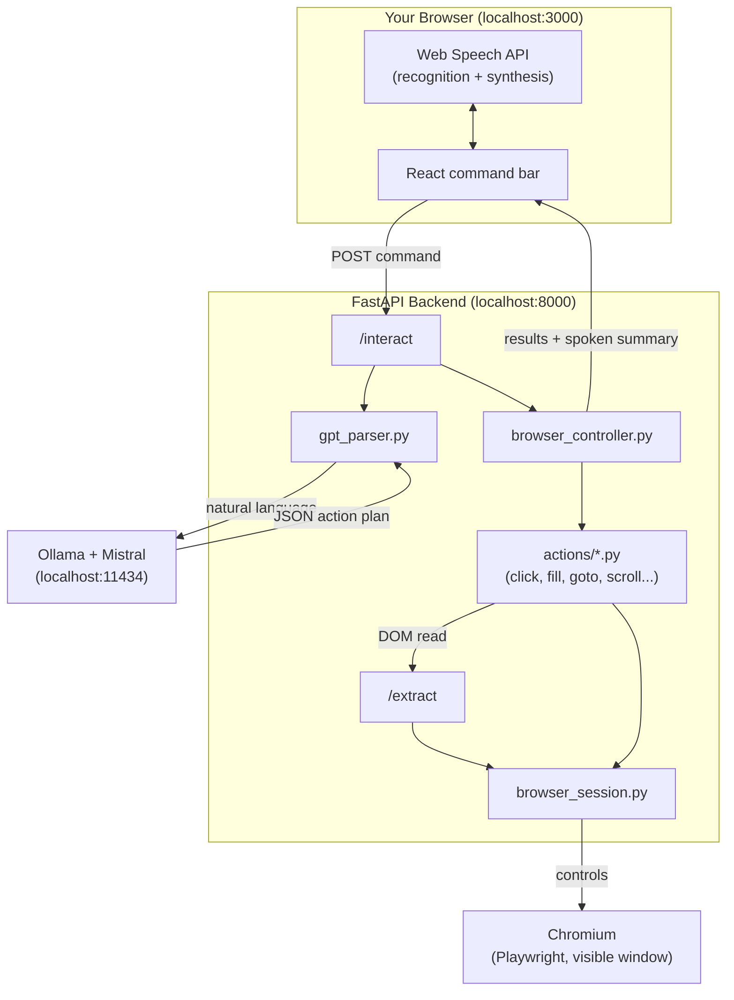

# Browser AI Agent

This is a personal automation agent that lets you control a browser using natural language — **typed or spoken**. You tell it what to do in plain English, and it figures out how to do that by parsing your request into a plan, executing it step-by-step in a real browser, and reporting back the results.

No special commands. Press the mic and say it, or just type something like:

```text
Search for "machine learning" on Wikipedia and take a screenshot
```

And it will:
- Open Wikipedia
- Fill in the search box
- Press Enter
- Scroll and wait if needed
- Capture the page

---
## 🎥 Demo Video

Watch the full product demo here:

[](https://www.loom.com/share/5fd6f10d394a46eb80567f09b1cd07f3)

## ⚙️ Installation Walkthrough

Step-by-step install guide: [Installation on Loom](https://www.loom.com/share/1e232cfd926942b48b09da2f5da11a51)

---

## Architecture

Three independent pieces, each replaceable on its own: a browser you can watch, an LLM that never leaves your machine, and a UI that accepts a voice the same way it accepts a keystroke.



**Request flow for one command:**
1. You type or say a command. Voice goes through the browser's own `SpeechRecognition`; no audio ever leaves the machine.
2. The frontend POSTs `{ command, source }` to `/interact`.
3. [`agents/gpt_parser.py`](agents/gpt_parser.py) sends the command plus a few-shot system prompt to a **local** Ollama model, and parses the reply into a JSON list of actions (`goto`, `click`, `fill`, `scroll`, `wait`, `keyboard_press`, `screenshot`, `dismiss_popup`).
4. [`agents/browser_controller.py`](agents/browser_controller.py) runs that plan step by step against the shared Playwright page, via the handlers in [`actions/`](actions/).
5. `click` resolves natural-language targets ("the second product") by asking [`api/extract_api.py`](api/extract_api.py) to parse the live DOM into a flat list of interactive elements with inferred roles, then matching by ordinal + role, falling back to fuzzy text matching, falling back to a raw selector from the LLM.
6. The backend returns per-step results, the parsed plan (for debugging), and a one-sentence `spoken_summary`. The frontend logs each step and, if enabled, reads the summary back out loud with `SpeechSynthesis`.

### Why a visible browser
Chromium launches with `headless=False` by default — watching it act is most of the point. That also means **the window it opens is the actual browser being driven**; closing it is like unplugging the agent, not closing an unrelated tab. [`browser_session.py`](browser_session.py) detects this (`is_alive()`) and transparently relaunches Chromium on the next command (`ensure_ready()`) instead of failing forever, but a relaunch starts from a blank page — you'll need to navigate/log in again.

### Why local everything
The LLM (Ollama), the browser (Playwright/Chromium), and the DOM parsing (BeautifulSoup) all run on your machine. Nothing about a command — typed or spoken — is sent to a third-party API, which is also why there's no API key to configure.

---

## How it works

### 1. The Brain (Backend)
- Built with **FastAPI** and **Playwright**
- Uses **Ollama + Mistral** to turn natural language into action plans (like fill, click, goto)
- Keeps a persistent browser session open using Chromium, and self-heals it if the window is closed or crashes mid-run
- Parses the DOM into structured elements with inferred semantic roles (login button, product link, add-to-cart, ...)
- Resolves clicks by ordinal + role first ("second product"), then fuzzy text match, then a raw selector — never by asking the LLM to guess CSS
- Can solve CAPTCHAs (Amazon's text-image kind) using Tesseract OCR — optional, skipped cleanly if not installed
- Every action is executed one by one with clear logs returned, and a run stops early with a clear message if the browser dies mid-plan instead of repeating the same low-level error per remaining step

### 2. The Face (Frontend)
- Built with **React + TailwindCSS**
- Command bar with both a text box and a **mic**
- Scrollable log of everything the agent is doing, color-coded by outcome
- Handles errors, failed clicks, selectors not found, timeouts, and backend-unreachable states distinctly

### 3. The Voice
Voice runs entirely in the browser through the **Web Speech API** — no audio
is uploaded anywhere, and there is no extra service to run.

- **Speech recognition** turns what you say into the same command string you
  would have typed, then sends it to `/interact`. Words appear in the box
  greyed out as you speak (interim results) and firm up when the recogniser
  commits to them.
- **Hands-free** mode (on by default) runs the command the moment you stop
  talking. Turn it off if you would rather review the transcript and press
  Send yourself.
- **Speak results** reads the outcome back out loud with speech synthesis, so
  a whole run can happen without touching the keyboard.
- The mic pulses red while listening, and the mic is suppressed while the
  agent is talking so its own voice is not transcribed back as a command.

Because the LLM is told the input may be dictated, it tolerates the usual
transcription quirks — `"wikipedia dot org"`, missing capitals, filler words.

**Browser support:** Chrome, Edge, and Safari implement the Web Speech API.
Firefox does not — there the mic is disabled with an explanation and typing
still works.

---

## Installation

This assumes you're running on macOS with Python 3.10+ and Node.js 18+ installed.

### 1. Clone the repo

```bash
git clone https://github.com/aarshitaacharya/browser-agent.git
cd browser-agent
```

### 2. Install and start Ollama (the local LLM)

```bash
brew install ollama
ollama serve &      # leave running; the backend talks to it on localhost:11434
ollama pull mistral  # one-time download, ~4 GB
```

Verify it's ready:
```bash
curl http://localhost:11434/api/tags
```

### 3. Set up the Python backend

```bash
python -m venv venv
source venv/bin/activate
pip install -r requirements.txt
playwright install chromium
```

Install Tesseract if you want CAPTCHA solving (optional — without it the agent
skips the CAPTCHA step rather than failing):

```bash
brew install tesseract
pip install -r requirements-ocr.txt
```

Start the backend:

```bash
PYTHONPATH=$(pwd) python -m uvicorn main:app --reload
```

This opens a visible Chromium window — that's the browser the agent controls, leave it open. The backend serves the API on `http://localhost:8000`; check `curl http://localhost:8000/health`.

### 4. Set up the React frontend

```bash
cd frontend
npm install
npm start
```

Make sure this runs on port 3000 (or set `REACT_APP_API_BASE`/`ALLOWED_ORIGINS` — see [Configuration](#configuration) — if you change either port).

### Shortcut

Once Ollama is running, [`build.sh`](build.sh) starts backend + frontend together:
```bash
source venv/bin/activate   # build.sh expects this active
./build.sh
```

---

## Usage

Once Ollama, the backend, and the frontend are all running:

- Open `http://localhost:3000` in **Chrome, Edge, or Safari**
- Type a command, or press the mic and say one:

```text
Log in to saucedemo.com with username standard_user and password secret_sauce
```

- Watch the steps show up in the log box as the agent acts, and watch the Chromium window — that's where it's actually happening

The first time you use the mic, the browser asks for microphone permission.
Voice input needs a secure context, which `http://localhost` counts as — if
you serve the frontend from another host, it must be over HTTPS.

You can:
- Take screenshots
- Solve CAPTCHAs (Amazon image-based ones)
- Scroll, click, fill forms
- Use ordinal commands like "click the second product"
- Click links, images, buttons, etc.

---

## Project structure

```text
browser-agent/
├── actions/                 # One handler per atomic browser action
│   ├── goto.py               # Navigate + trigger Amazon CAPTCHA solve
│   ├── click.py               # Ordinal+role match -> fuzzy text -> raw selector
│   ├── fill.py                 # Fill a field, with Google-search fallback selectors
│   ├── keyboard_press.py
│   ├── scroll.py
│   ├── wait.py
│   ├── screenshot.py
│   ├── dismiss_popup.py       # Iframe-aware cookie/consent banner dismissal
│   └── captcha_solver.py      # Optional OCR-based Amazon CAPTCHA solver
├── agents/
│   ├── gpt_parser.py           # Natural language -> JSON action plan (Ollama)
│   └── browser_controller.py   # Runs a plan step by step, stops early if the browser dies
├── api/
│   ├── interact_api.py         # POST /interact - the main entry point
│   └── extract_api.py          # POST /extract - DOM -> structured elements
├── prompts/
│   └── prompt_examples.txt     # Few-shot examples fed to the LLM
├── browser_session.py          # Owns the Chromium instance; self-heals if it dies
├── utils/logger.py             # Shared logger (file + stdout)
├── main.py                     # FastAPI app, CORS, lifespan startup/shutdown, /health
├── requirements.txt            # Core backend dependencies
├── requirements-ocr.txt        # Optional: pillow + pytesseract for CAPTCHA solving
├── build.sh                    # Dev script to launch frontend + backend together
└── frontend/
    ├── .env.example             # REACT_APP_API_BASE override
    └── src/
        ├── App.js                # Command bar, log, voice toggles - the whole UI
        ├── config.js              # Backend base URL (from REACT_APP_API_BASE)
        ├── components/
        │   ├── MicButton.js        # Mic icon + listening/unsupported states
        │   └── Toggle.js            # Small labelled switch (hands-free, speak results)
        └── hooks/
            ├── useSpeechRecognition.js  # Web Speech API -> interim/final transcript
            └── useSpeechSynthesis.js    # Reads a result summary back out loud
```

## Configuration

Everything has a working default; these are only for non-standard setups.

| Variable | Side | Default | Purpose |
| --- | --- | --- | --- |
| `OLLAMA_HOST` | backend | `http://localhost:11434` | Where Ollama is listening |
| `OLLAMA_MODEL` | backend | `mistral` | Model used for planning |
| `ALLOWED_ORIGINS` | backend | `http://localhost:3000` | Comma-separated CORS origins |
| `HEADLESS` | backend | unset (visible) | Set to `1` to run Chromium without a window |
| `REACT_APP_API_BASE` | frontend | `http://localhost:8000` | Backend base URL (see `frontend/.env.example`) |

CAPTCHA solving needs `pillow` and `pytesseract` plus the Tesseract binary. If
they are missing the agent simply skips that step instead of failing to start.

---

## Troubleshooting

**`model 'mistral' not found`** — Ollama is running but the model hasn't been pulled: `ollama pull mistral`.

**"Failed to fetch" / "Could not reach the agent"** — the backend isn't running, or died. Check `curl http://localhost:8000/health`; `browser_ready: false` means the browser needs a moment to relaunch (it happens automatically on your next command).

**A command that used to work now fails immediately** — you likely closed the Chromium window. The agent detects this and opens a fresh one on your next command, but it starts blank, so re-navigate or re-log-in as needed.

**"Timed out after 120s"** — the request is taking unusually long (cold LLM start, a slow page). Check the Chromium window and the backend terminal; if it's genuinely stuck, restart the backend.

**Voice input is greyed out / mic button disabled** — your browser doesn't support the Web Speech API. Use Chrome, Edge, or Safari; typing still works everywhere.

---

## Why this is fun

This app is fun because it's not just a chatbot. It actually does stuff. It clicks. It scrolls. It fills. It sees a CAPTCHA and tries to solve it. It's a little browser assistant that doesn't need hand-holding.

The coolest part? You can teach it new behaviors by just improving the LLM prompt or extracting more structure from the page.

And yeah, it's still a work in progress. But it's real. And it works.

---

## Coming soon

- Better CAPTCHA solving
- Memory of previous pages
- Wake word, so the mic does not need a click
- Screenshot gallery
